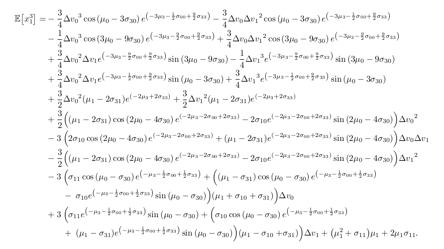

# Generate Post-Manoeuvre Moments of the Target Distribution in Log-Polar Coordinates

Consider a bearings-only tracking problem in log-polar coordinates (LPC). LPC comprises the variables bearing, bearing
rate, scaled range rate, and log-range, such that the target state, $\mathbf{x}$, is $[\beta, \dot{\beta}, \dot{\rho},
\rho]$. We cannot recover the range until the ownship containing the passive sensor manoeuvres such that we wish to
predict the post-manoeuvre target state, $\mathbf{x}^+ = [\beta^+, \dot{\beta}^+, \dot{\rho}^+, \rho^+]$ from the
pre-manoeuvre state, $\mathbf{x}$.

When using LPC, we can derive the posterior Cramér–Rao bound for the target state [[1]](#1). Using this result, it is
possible to express the distribution of the target state before, or after an ownship manoeuvre in closed-form. That is,
we can write the mean, covariance, and any higher-order moments. This is derived in our preprint publication
_An insightful approach to bearings-only tracking in log-polar coordinates_ [[2]](#2).

This package generates a given moment up to any integer order as either a Python function or LaTeX expression.

## Set-Up
The file `environment.yml` provides the minimal conda configuration required for running `seaweed`.

## Generating Moments
We can generate a specific post-manoeuvre moment by specifying which variables we differentiate *or* all post-manoeuvre
moments up to some desired integer order, $N$.

To do this, we run

`sage post-manoeuvre-moments.sage`

with the argument(s)

`--order X0,X1,X2,X3` where `Xi` for $i = [0, 1, 2, 3]$ specifies the differentiation for the $i$th variable in LPC,
such that we have a moment of order $N = \sum_{i=0}^3 X_i$.

*or*

`-N M` where `M` is the desired maximum integer order to generate moments.

We also need to specify the desired output folder location with the argument

`--output-folder <some/temp/dir>` or

such that the desired moment(s) are contained within `some/temp/dir/impl/`.

**Optional arguments**

* `--num-parallel=C` - specify the number of CPU cores to use, C, where C = 0 uses all CPU cores available
* `-v` - give some output while running

**Examples**

i. Generate the second raw post-manoeuvre moment of bearing rate, $\mathbb{E} = \left[ \left( \dot{\beta}^+ \right)^2
\right]$ and write to the folder `pm_br`

`sage post-manoeuvre-moments.sage --order 0,2,0,0 --output-folder pm_br`

ii. Generate the second raw post-manoeuvre moments of bearing and bearing rate, $\mathbb{E} = \left[ \beta^+
\dot{\beta}^+ \right]$ and write to the folder `pm_b_br`

`sage post-manoeuvre-moments.sage --order 1,1,0,0 --output-folder pm_b_br`

iii. Generate _both_ moments specified in examples i and ii and write to the folder `pm_bbr` with verbose output

`sage post-manoeuvre-moments.sage -v --order 0,2,0,0 --order 1,1,0,0 --output-folder pm_bbr`

iv. Generate all moments up to order 4 and write to the folder `pm_4` using all available CPU cores

`sage post-manoeuvre-moments.sage --num-parallel=0 -N 4 --output-folder pm_4`

## Calculating Moments
For convenience, we have pre-generated moments up to order $N = 5$. These are stored in the `post_manoeuvre` module
and are imported as so (assuming the conda environment is installed)
```
# Import package and numpy for arrays
from seaweed import post_manoeuvre
import numpy as np

# Define the speed change, mean and covariance desired for substitution
dv = np.array([2, -3])
mu = np.array([0.58, 1.1, 0.1, -1.7])
Sigma = np.array([[0.05, 0.002, 0.003, 0.002],
                 [0.002, 0.2, 0.003, 0.002],
                 [0.003, 0.003, 0.2, 0.003],
                 [0.002, 0.002, 0.003, 0.63]])

# Substitute into fourth raw moment of scaled range rate
post_manoeuvre.moment_0040(dv, mu, Sigma)
```

## Displaying Moments
We present the rendered third raw moment of bearing rate in LaTeX below.

```
# Import package
from seaweed import post_manoeuvre

# Print third raw moment of bearing rate
post_manoeuvre.latex_0300()
```

There is a minor stylistic difference between the generated moments and the main body of [[2]](#2); the two components
of ownship speed change, $\Delta v_x$ and $\Delta v_y$, are respectively written as $\Delta v_0$ and $\Delta v_1$. To produce the typeset equation below, we also manually adjusted line spacing and added alignment markers to fit the equation to the page.



## Unit Testing
The Python unit tests for the three SageMath scripts under the `sage` folder can be run with `pytest` and the following
optional flags:
* `--run-slow` - applies to a few tests in `test_pmm.py` that take over an hour to run
* `-v` - give some output while running.

## Directory
* **`sage`**
    * `mgf.sage` - Moment-generating function of a quadrivariate Gaussian distribution.
    * `pmm.sage` - Derives the post-manoeuvre moments of the target state.
    * `utils.sage` - Tools for the scripts above.
* **`scripts`**
    * `post-manoeuvre-moments.sage` - The main script invoking all the calculations
* **`seaweed`**
    * **`post_manoeuvre`** - Sample output of running the `post-manoeuvre-moments.sage` script for $N = 5$.
        * **`impl`** - Pre-exported moments.
* **`tests`** - Python unit tests for the SageMath scripts in `sage`, formatted as `test_<name>` where `<name>` is the
name of the corresponding script being tested.

## Citations
<a id="1">[1]</a> T. Brehard and J. R. Le Cadre. _Closed-form posterior Cramer-Rao bounds for bearings-only tracking_.
*IEEE Transactions on Automatic Control*, 28 (3): 283-294, March 1983.

<a id="2">[2]</a> A. H. Xiourouppa, D. Mikhin, M. Humphries and J. Maclean. _Theoretical Insights for Bearings-Only Tracking in Log-Polar Coordinates_.
[Preprint] 2024.
